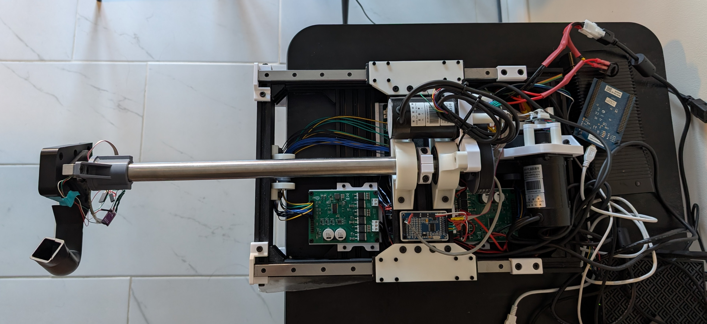

# Force Feedback Yoke
A DIY force feedback flight simulator yoke using brushless motors, load cells, and custom firmware to provide simulated control forces.

---

## Overview
- BLDC motors for pitch and roll using torque control.
- Support for load cells. Currently used for force feedback assist (reduces drag felt by user).
- STM32 microcontroller running custom firmware with FOC inspired by SimpleFOC.
- Desktop app for monitoring, setting parameters, handling communication between device and Microsoft Flight Simulator, and calculating forces.

## Features
- Support for 2 axis current/torque control.
- Force feedback assist using load cells to reduce drag.
- USB HID communication.
- Support for constant, spring, and damper effects on both axes.
- Axes travel is software adjustable using the motor as a virtual stopper.

## Technical Details
- Motors: 2 * 57BL95S06-210TF9
- Motor Drivers: 2 * DRV8301 boards
- Microcontroller: STM32H743VGT6
- Sensors:
	- 2 * three phase shunt-based in-line current sensors (INA241)
	- 2 * encoders using AB output (65536 CPR) for lower latency (MT6835)
	- 2 * load cells (20kg) (roll load cell support for mechanical is in progress)
- Software: C firmware, C# desktop app

## Mechanical
- Total pitch travel: ~177 mm, roll travel: ~270 deg
- 3D printed components, aluminum V-slot extrusion for frame. T-slot is also compatible.
- Bearings on all axes, two linear guide rails for linear motion on pitch axis.
- Two-stage belt drive for pitch axis, single belt for roll axis.
- Designed to be modular.

## Desktop App
- Displays live axes positions, and axes force/torque
- Implements custom USB HID communication with device and communication with Microsoft Flight Simulator through SimConnect API.
- Currently supports 2 different force feedback effects, with more being added and existing effects being refined:
	- Supported effects
		- Airspeed stiffness (increases centering force with airspeed)
		- Elevator weight (a constant elevator down force with engine RPM dependent self-centering force).
- Adjustable gains for all force feedback effects in GUI for both pitch and roll axes.
- Travel for both axes are adjustable in GUI.

## Acknowledgements
Algorithms (Clarke & Park transforms) from [SimpleFOC](https://github.com/simplefoc/Arduino-FOC) (MIT License). See LICENSES/LICENSE-SIMPLEFOC.txt for full license.
